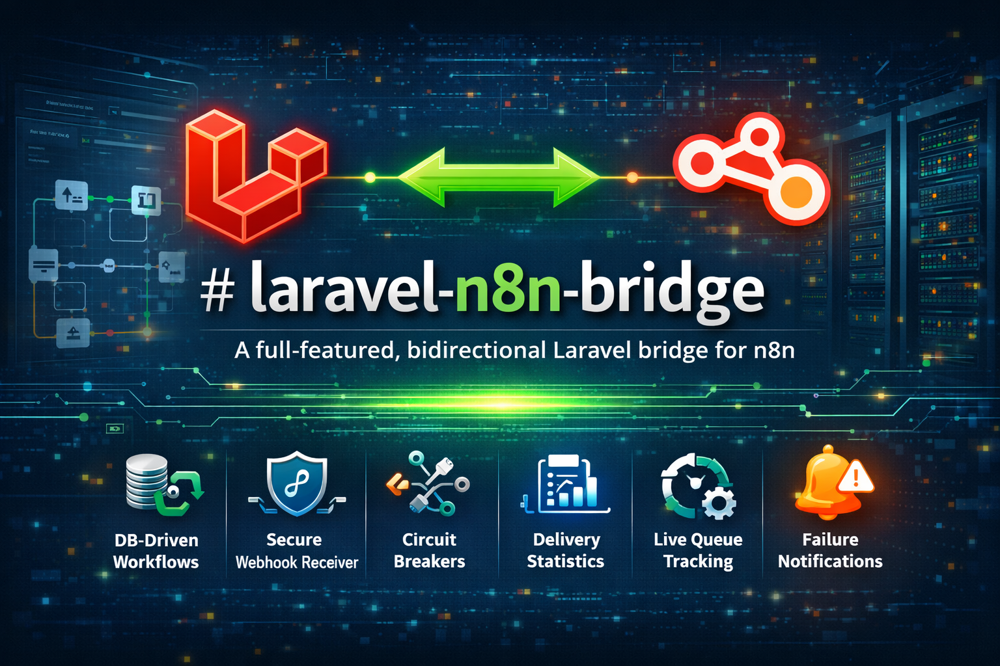

# 🔐 Credential Authentication

← [Back to README](../README.md)

Every HTTP call between n8n and your Laravel application is authenticated using a credential key. One credential can be shared across multiple endpoints and tools — or you can assign multiple credentials to the same resource.

---

## Concept

```
n8n instance
    │
    │  X-N8N-Key: n8br_sk_xxxxxxxx   (same header on every node)
    │
    ├── POST /n8n/in/invoice-paid      ✅ authenticated
    ├── GET  /n8n/tools/invoices       ✅ authenticated
    ├── POST /n8n/tools/send-invoice   ✅ authenticated
    └── POST /n8n/queue/progress/{id}  ✅ authenticated
```

All modules share the same `CredentialAuthService` — there is one place in the codebase where key verification happens.

### Many-to-many credential model

Credentials attach to endpoints and tools via pivot tables (many-to-many):

```
N8nCredential  ──<  endpoint_credentials  >──  N8nEndpoint
N8nCredential  ──<  tool_credentials      >──  N8nTool
```

**Access rules:**
| Credentials attached to resource | Behaviour |
|---|---|
| None | Request is rejected — 401 Unauthorized (every resource must have at least one credential) |
| One or more | Only keys belonging to one of those credentials are accepted |

---

## Setup

### 1. Create a credential

```bash
php artisan n8n:credential:create "Production" --instance=default
```

Output:
```
✅ Credential created!
  ID:       1
  Name:     Production
  Instance: default

  🔑 API Key (copy now — shown once):
     n8br_sk_a3f9b2c1d4e5f6a7b8c9d0e1f2a3b4c5d6e7f8

  In n8n: Personal → Credentials → Create credential → Header Auth
           Name:  X-N8N-Key
           Value: n8br_sk_a3f9b2c1d4e5f6...
```

### 2. Register endpoints and attach the credential

`n8n:endpoint:create` automatically creates a dedicated credential and API key for the new endpoint:

```bash
php artisan n8n:endpoint:create invoice-paid \
  --handler="App\N8n\InvoicePaidHandler"
# → Outputs its own API key immediately (shown once)
```

If you prefer a **shared credential** across multiple endpoints and tools, create it first and then attach:

```bash
# Create tool (GET list + POST action)
php artisan n8n:tool:create invoices \
  --handler="App\N8n\Tools\InvoicesTool" \
  --methods=GET,POST

# Attach the shared credential to everything at once
php artisan n8n:credential:attach {id} --all
```

Or attach selectively:
```bash
php artisan n8n:credential:attach {id} \
  --inbound=invoice-paid \
  --tool=invoices
```

### 3. Configure in n8n

Create one credential in n8n, reuse it on every HTTP Request node:

```
Personal → Credentials → Create credential → Header Auth
  Name:  X-N8N-Key
  Value: n8br_sk_xxxxxxxx
```

That's it — no separate credentials per endpoint or tool.

---

## How it works

Every request passes through `CredentialAuthService`:

```
Request arrives at /n8n/in, /n8n/tools, or /n8n/queue/progress
    │
    ▼  Extract key from X-N8N-Key header (or Authorization: Bearer)
    ▼  Find credential with matching active/grace key (hash_equals, constant-time)
    ▼  Check credential is_active = true
    ▼  (Optional) Verify request IP against credential's allowed_ips
    ▼  Check resource credentials (must have at least one):
    │     └── none attached  → 401 Unauthorized (resource must have a credential)
    │     └── 1+ attached    → key must belong to one of those credentials
    │
    ├─ Match → request proceeds
    └─ No match → 401 Unauthorized
```

Keys are stored as SHA-256 hashes — the plaintext is never saved. Verification uses `hash_equals()` to prevent timing attacks. Auth results are cached for 60 seconds per key.

---

## Key lifecycle

### Prefix

All credential keys start with `n8br_sk_` — easy to identify in logs and dashboards.

### Status

| Status | Usable | When |
|---|---|---|
| `active` | ✅ | Normal state |
| `grace` | ✅ | After rotation, during transition window |
| `revoked` | ❌ | Permanently disabled |

### Rotation (zero downtime)

```bash
php artisan n8n:credential:rotate {id} --grace=300
```

1. Old key enters `grace` status — still valid for 300 seconds
2. New key is generated and immediately active
3. Update n8n credential within the grace window
4. Old key automatically becomes unusable after grace period expires

Both keys work simultaneously during the grace window.

### Via code

```php
use Oriceon\N8nBridge\Models\N8nCredential;

$credential = N8nCredential::find($id);

// Rotate with 5-minute grace
[$newPlaintext] = $credential->rotateKey(gracePeriodSeconds: 300);

// Verify manually
$credential->verifyKey($plaintext); // true/false

// Revoke all keys
$credential->apiKeys()->update(['status' => 'revoked']);
```

---

## Multiple credentials on the same resource

You can attach more than one credential to the same endpoint or tool. Any of their keys will be accepted:

```bash
# Attach both production and staging credentials to the same tool
php artisan n8n:credential:attach {prod-credential-id}    --tool=invoices
php artisan n8n:credential:attach {staging-credential-id} --tool=invoices
```

Or from code:

```php
$tool = N8nTool::where('name', 'invoices')->firstOrFail();
$tool->credentials()->syncWithoutDetaching([$credA->id, $credB->id]);
```

---

## Detaching credentials

```bash
# Remove a single credential from an endpoint
php artisan n8n:credential:attach {id} --detach-inbound=invoice-paid

# Remove a single credential from a tool
php artisan n8n:credential:attach {id} --detach-tool=invoices

# Remove credential from all endpoints and tools
php artisan n8n:credential:attach {id} --detach-all
```

> **Warning:** detaching all credentials from a resource causes it to reject every request with 401. Always keep at least one credential attached.

---

## Per-endpoint restrictions

The credential key authenticates *who* is calling. You can additionally restrict *what* they can do:

### IP whitelist (credential-level)

Applies to all requests made with this credential's key:

```bash
php artisan n8n:credential:create "Production" --ips=203.0.113.10,203.0.113.11
```

### HTTP method restriction (tools)

Make a tool read-only regardless of handler implementation:

```bash
php artisan n8n:tool:create invoices --handler="..." --methods=GET
```

### Rate limiting (per tool/endpoint)

```bash
php artisan n8n:tool:create invoices --handler="..." --rate-limit=120
php artisan n8n:endpoint:create invoice-paid --handler="..." --rate-limit=30
```

---

## Multiple n8n instances

Create one credential per n8n instance:

```bash
php artisan n8n:credential:create "Production" --instance=default
php artisan n8n:credential:create "Staging"    --instance=staging
```

A staging key cannot access production endpoints (as long as they have credentials attached).

---

## Artisan commands

```bash
# Create credential + first key
php artisan n8n:credential:create "Production"
php artisan n8n:credential:create "EU Production" --instance=eu --ips=203.0.113.1

# List all credentials
php artisan n8n:credential:list

# Rotate key (zero-downtime)
php artisan n8n:credential:rotate {id}
php artisan n8n:credential:rotate {id} --grace=600

# Attach credential to endpoints/tools
php artisan n8n:credential:attach {id} --all
php artisan n8n:credential:attach {id} --inbound=invoice-paid --tool=invoices

# Detach credential from endpoints/tools
php artisan n8n:credential:attach {id} --detach-inbound=invoice-paid
php artisan n8n:credential:attach {id} --detach-tool=invoices
php artisan n8n:credential:attach {id} --detach-all
```

---

## Testing

```php
use Oriceon\N8nBridge\Models\N8nCredential;
use Oriceon\N8nBridge\Models\N8nTool;
use Oriceon\N8nBridge\Models\N8nEndpoint;

$credential = N8nCredential::create(['name' => 'Test', 'is_active' => true]);
[$plaintext] = $credential->generateKey();

// Attach to tool via pivot
$tool = N8nTool::where('name', 'invoices')->firstOrFail();
$tool->credentials()->syncWithoutDetaching([$credential->id]);

// Authenticated GET request
$this->getJson('/n8n/tools/invoices', ['X-N8N-Key' => $plaintext])
    ->assertOk();

// Attach to inbound endpoint
$endpoint = N8nEndpoint::where('slug', 'invoice-paid')->firstOrFail();
$endpoint->credentials()->syncWithoutDetaching([$credential->id]);

$this->postJson('/n8n/in/invoice-paid', $payload, ['X-N8N-Key' => $plaintext])
    ->assertStatus(202);

// Use factory helper
$tool2 = N8nTool::factory()
    ->forCredential($credential)
    ->create(['name' => 'contacts']);

// Multiple credentials — any key works
$endpoint2 = N8nEndpoint::factory()
    ->forCredential($credA)
    ->forCredential($credB)
    ->create(['slug' => 'shared-endpoint']);
```
